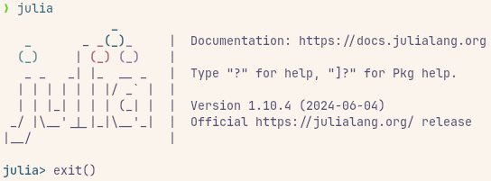

# Getting Started with Julia

- Install `julia` and `juliaup`.
- Setup a new project.

### Install `julia` and `juliaup`.

- Follow instructions from the [official website](https://julialang.org/downloads/) as it's the recommended way to install `julia`.

- Make sure `julia` is installed properly by opening a terminal and running the following command.

```sh {"id":"01J5RK8FSSC45C46ET852MHTPD"}
julia
```

- You should be able to enter the Julia REPL.

- Run the following command to exit the REPL.

```julia {"id":"01J5RK8FSSC45C46ET8572HQ1C"}
exit()
```



### Setup a new project.
